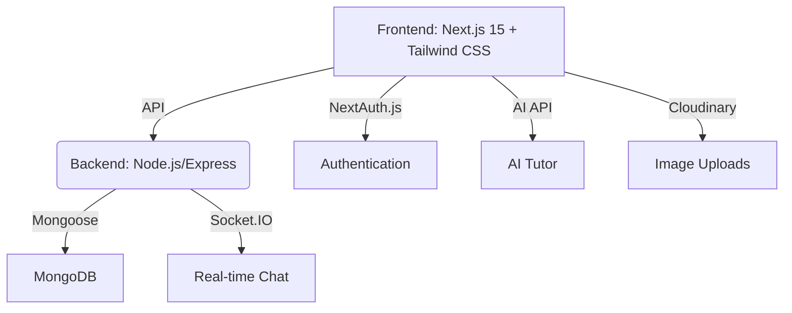

<p align="center">
  
</p>

<h1 align="center">DevCortex</h1>
<p align="center"><b>The Open Platform for Developer Learning, Collaboration, and Innovation</b></p>

<p align="center">
  <a href="https://nextjs.org/"></a>
  <a href="https://nodejs.org/"></a>
  <a href="https://www.mongodb.com/"></a>
  <a href="https://vercel.com/"></a>
  <a href="LICENSE"></a>
</p>

---

## 🚀 Vision

DevCortex is more than a platform-it's a movement to empower developers everywhere to learn, build, and collaborate at the highest level. Our mission is to create the most engaging, open, and innovative space for:

- **Cutting-edge tech education**
- **Real-time collaboration and cohort learning**
- **Community-driven project inspiration**
- **AI-powered mentorship and support**

We believe in a world where every developer can access world-class resources, connect with peers, and turn ideas into reality-together.

---

## ✨ Features

- **📰 Tech News & Commentary**: Stay ahead with curated news, expert insights, and community discussions.
- **💡 Project Idea Gallery**: Discover, share, and collaborate on innovative project ideas.
- **🧑‍💻 Interactive Coding Tutorials**: Learn by doing with live code playgrounds and hands-on challenges.
- **📚 Course Management**: Create, manage, and participate in comprehensive tech courses.
- **🤖 AI Tutor**: Get instant, personalized help and feedback from an integrated AI assistant.
- **💬 Real-time Cohort Chat**: Join live chat rooms, share files, react, and collaborate in real time.
- **🔒 Secure Authentication**: NextAuth.js with Google, GitHub, and credentials support.
- **📈 Progress Tracking & Certificates**: Visualize your learning journey and earn verifiable certificates.
- **🌐 Social & Networking**: Build your tech identity, connect with peers, and grow your influence.

---

## 🏗️ Architecture

<details>
<summary>Click to expand: High-level architecture diagram</summary>


</details>

---

## 🖥️ Screenshots

<p align="center">
  
  
</p>

---

## ⚡ Quickstart

### 1. Clone & Install

```bash
git clone https://github.com/natnael-eyuel-dev/devcortex.git
cd devcortex
npm install
```

### 2. Configure Environment

Create a `.env.local` file in the root directory:

```env
# Database
MONGODB_URI=your_mongodb_connection_string

# NextAuth
NEXTAUTH_URL=http://localhost:3000
NEXTAUTH_SECRET=your_nextauth_secret

# OAuth Providers
GOOGLE_CLIENT_ID=your_google_client_id
GOOGLE_CLIENT_SECRET=your_google_client_secret
GITHUB_CLIENT_ID=your_github_client_id
GITHUB_CLIENT_SECRET=your_github_client_secret

# Email (Resend)
RESEND_API_KEY=your_resend_api_key

# Cloudinary (for image uploads)
NEXT_PUBLIC_CLOUDINARY_CLOUD_NAME=your_cloudinary_cloud_name
CLOUDINARY_API_KEY=your_cloudinary_api_key
CLOUDINARY_API_SECRET=your_cloudinary_api_secret
```

### 3. Database Setup (Optional)

```bash
npm run reset-db      # Reset database
npm run seed-admin    # Seed admin user
npm run seed-news     # Seed sample news
```

### 4. Start the Platform

```bash
npm run dev     # Visit http://localhost:3000
```

---

## 🛠️ Usage

### Available Scripts

- `npm run dev` - Start development server (with Socket.IO)
- `npm run build` - Build for production
- `npm run start` - Start production server
- `npm run lint` - Run ESLint
- `npm run reset-db` - Reset database
- `npm run seed-admin` - Seed admin user
- `npm run seed-news` - Seed sample news

### Custom Server for Real-time Chat

DevCortex uses a custom server (`server.ts`) to power real-time cohort chat, supporting:

- Live messaging, typing indicators, reactions
- File sharing, message editing/deletion
- User presence and course-specific chat rooms

---

## 📂 Project Structure

```text
devcortex/
├── src/
│   ├── app/            # Next.js App Router
│   ├── components/     # Reusable React components
│   ├── hooks/          # Custom React hooks
│   ├── lib/            # Utilities & configs
│   └── db/             # Database schemas & access
├── scripts/
│   ├── create-admin.ts # Bootstrap script
│   └── migrate.ts      # Example migration script
├── tests/              # Unit/integration tests
├── docs/               # Documentation, guides, diagrams
├── public/             # Static assets
├── server.ts           # Custom server (Socket.IO)
├── .env.example        # Example environment vars
├── CONTRIBUTING.md     # Contribution guidelines
└── README.md           # Project overview
```

---

## 🤝 Contributing

We welcome contributions from everyone! To get started:

1. **Fork** the repository
2. **Create** a feature branch (`git checkout -b feature/your-feature`)
3. **Commit** your changes with clear messages
4. **Test** thoroughly
5. **Open a Pull Request**

Please read our [Code of Conduct](CODE_OF_CONDUCT.md) and [Contributing Guide](CONTRIBUTING.md) (coming soon).

---

## 🗺️ Roadmap

- [ ] **Open API for Integrations**
- [ ] **Mobile App (React Native)**
- [ ] **Gamification & Badges**
- [ ] **Advanced AI Tutor (LLM-based)**
- [ ] **Marketplace for Courses & Projects**
- [ ] **In-app Video Conferencing**
- [ ] **Plugin Ecosystem**
- [ ] **Localization & Accessibility**

See [GitHub Issues](https://github.com/natnael-eyuel-dev/devcortex/issues) for more.

---

## 📜 License

This project is licensed under the [MIT License](LICENSE).

---

## 🙏 Acknowledgments

- Inspired by the best of [Next.js](https://github.com/vercel/next.js), [React](https://github.com/facebook/react), and [MongoDB](https://www.mongodb.com/).
- Thanks to all contributors and the open-source community.
- Special thanks to educators, mentors, and learners worldwide who inspire us to build a better future for developers.

---

<p align="center">
  <b>DevCortex - Empowering Developers, Together.</b>
</p>
